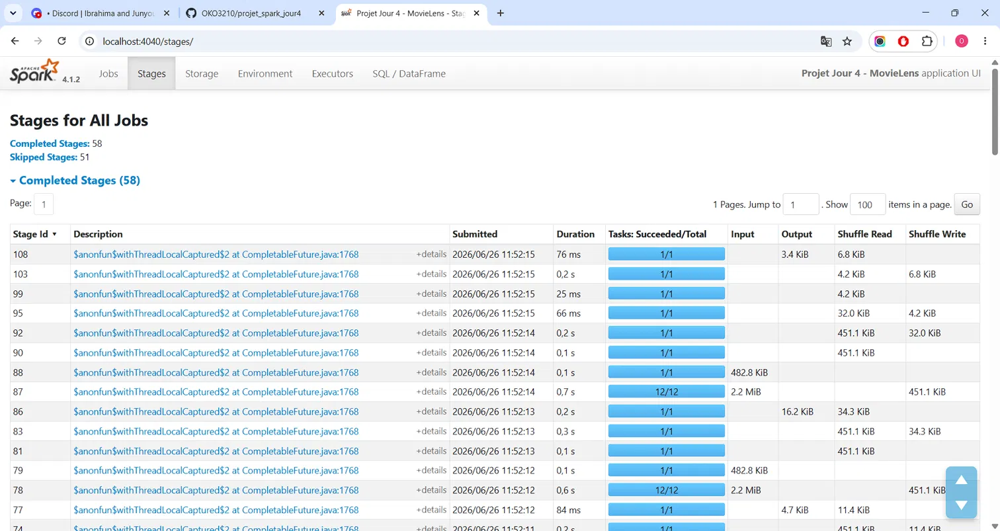

# Rapport de projet - Pipeline Spark (Jour 4)

- **Équipe** : Omar Konte et Jiek Ruan
- **Jeu de données** : MovieLens (ml-latest-small)
- **Date** : 26/06/2026

---

## 1. Jeu de données et schéma cible

Nous avons travaillé sur MovieLens `ml-latest-small`, un jeu de notes de films produit par le groupe de recherche GroupLens. Il contient 100 836 notes attribuées par 610 utilisateurs sur 9 742 films, entre 1996 et 2018. Les notes vont de 0,5 à 5,0 par pas d'une demi-étoile.

Deux fichiers nous servent :

- `ratings.csv` : la table de faits, une ligne par note.
- `movies.csv` : la table de référence, une ligne par film (titre et genres).

Schéma cible que nous imposons à la lecture (schéma explicite, pas d'inférence) :

| Fichier | Colonne | Type |
|---|---|---|
| ratings | userId | int |
| ratings | movieId | int |
| ratings | rating | double |
| ratings | timestamp | long |
| movies | movieId | int |
| movies | title | string |
| movies | genres | string |

À partir de `timestamp`, nous dérivons `date_note` (date) puis `annee_note` (entier), qui sert ensuite de clé de partitionnement.

Questions métier visées :

1. Quels films sont les mieux notés, une fois écartés ceux qui ont trop peu de votes pour être fiables ?
2. À quels titres et genres correspondent ces films (enrichissement par jointure) ?
3. Quels sont les trois meilleurs films de chaque genre ?

---

## 2. Pipeline (bronze -> silver -> gold)

```
brut (bronze)  ->  nettoyé (silver, Parquet)  ->  agrégé (gold)
```

**Nettoyage appliqué sur les ratings.** Nous lisons le CSV avec le schéma explicite, puis nous appliquons trois contrôles : suppression des lignes incomplètes (`na.drop` sur userId, movieId, rating), suppression des doublons sur la clé `(userId, movieId)`, et filtre des notes hors de l'intervalle [0,5 ; 5,0].

**Lignes brutes : 100 836 | après nettoyage : 100 836 | écartées : 0 %.**

Aucune ligne n'est retirée, et c'est un résultat en soi : le jeu étant curé par GroupLens, le nettoyage joue un rôle de garde-fou (il confirme qu'il n'y a ni manquant, ni doublon, ni note hors barème) plutôt que de correction. Nous avons préféré écrire ces contrôles et constater qu'ils ne retirent rien, plutôt que de les omettre en supposant le jeu propre.

**Contrôle d'intégrité référentielle.** Avant les analyses, nous vérifions par une jointure anti (`left_anti`) que chaque note pointe vers un film existant dans `movies`. Résultat : 0 note orpheline. Le jeu est cohérent entre les deux tables, ce qui valide la jointure de l'analyse 2.

**Partitionnement de la silver.** Nous écrivons la couche silver en Parquet, partitionnée par `annee_note`. C'est une colonne à faible cardinalité (une vingtaine d'années), ce qui évite de créer une multitude de petits fichiers, et elle a un sens métier (l'année de la note). La distribution par année est cohérente, avec des pics en 2000 (10 061 notes) et 2007 (7 114 notes).

---

## 3. Analyses

### Analyse 1 - agrégation

- **Question** : quels films ont la meilleure note moyenne, avec au moins 50 votes ?
- **Code clé** :

```python
(ratings
 .groupBy("movieId")
 .agg(
     F.round(F.avg("rating"), 2).alias("note_moyenne"),
     F.count("*").alias("nb_votes"),
 )
 .filter(F.col("nb_votes") >= SEUIL_VOTES)
 .orderBy(F.desc("note_moyenne")))
```

- **Résultat (extrait)** :

```
movieId  note_moyenne  nb_votes
318      4.43          317
858      4.29          192
1276     4.27          57
750      4.27          97
2959     4.27          218
```

- **Lecture métier** : le seuil de 50 votes est volontaire. Sans lui, le « mieux noté » serait un film noté 5,0 par une seule personne, c'est-à-dire du bruit. En l'imposant, on classe sur une note fiable. En tête, le film 318 (4,43 sur 317 votes) est à la fois très bien noté et très vu, ce qui en fait un résultat solide.

### Analyse 2 - jointure

- **Question** : à quels titres et genres correspondent les films les mieux notés ?
- **Code clé** :

```python
(films_agg
 .join(F.broadcast(movies), "movieId", "inner")
 .select("movieId", "title", "genres", "note_moyenne", "nb_votes")
 .orderBy(F.desc("note_moyenne")))
```

- **Résultat (extrait)** :

```
title                              genres        note_moyenne  nb_votes
Shawshank Redemption, The (1994)   Crime|Drama   4.43          317
Godfather, The (1972)              Crime|Drama   4.29          192
Fight Club (1999)                  Action|...    4.27          218
```

- **Lecture métier** : la jointure rattache l'information descriptive (titre, genres) aux notes agrégées. On retrouve en tête des classiques largement reconnus, ce qui donne confiance dans la chaîne de traitement. Le détail de l'optimisation de cette jointure est en section 4.

### Analyse 3 - window function

- **Question** : quels sont les trois meilleurs films de chaque genre ?
- **Code clé** :

```python
fenetre = Window.partitionBy("genre").orderBy(
    F.desc("note_moyenne"), F.desc("nb_votes")
)
(films_enrichis
 .withColumn("genre", F.explode(F.split(F.col("genres"), "\\|")))
 .filter(~(F.col("genre") == "(no genres listed)"))
 .withColumn("rang", F.row_number().over(fenetre))
 .filter(F.col("rang") <= TOP_N))
```

- **Résultat (extrait)** :

```
genre   rang  title                              note_moyenne  nb_votes
Action  1     Fight Club (1999)                  4.27          218
Action  2     Dark Knight, The (2008)            4.24          149
Action  3     Star Wars: Episode IV (1977)       4.23          251
Crime   1     Shawshank Redemption, The (1994)   4.43          317
Drama   1     Shawshank Redemption, The (1994)   4.43          317
```

- **Lecture métier** : comme un film porte plusieurs genres (par exemple `Crime|Drama`), nous éclatons d'abord la colonne `genres` pour avoir une ligne par couple (film, genre). Un même film peut donc figurer dans le top de plusieurs genres, ce qui est le comportement attendu (Shawshank est premier en Crime et en Drama). On note aussi que les genres de niche, comme Documentary, plafonnent plus bas (3,78 en tête) car peu de leurs films atteignent le seuil de votes.

---

## 4. Optimisation

- **Optimisation choisie** : broadcast join sur la jointure ratings agrégés × movies.
- **Pourquoi** : `movies` est une petite table (9 742 lignes). En la diffusant (broadcast) à tous les exécuteurs, Spark évite de redistribuer la grande table par un shuffle. Sans broadcast, Spark fait un sort-merge join qui shuffle les deux côtés.
- **Mesure avant/après et extrait de plan** :

```
sort-merge (shuffle) : 1.300 s   |   broadcast : 1.067 s
```

Le plan sans broadcast (fichier `plan__1_.svg`) montre un `SortMergeJoin` précédé d'un `Exchange hashpartitioning(movieId, 64)` de chaque côté. Le plan avec broadcast (fichier `plan__2_.svg`) montre un `BroadcastHashJoin` et un `BroadcastExchange` : le shuffle de la table de faits a disparu.

> Pour isoler l'effet du broadcast, nous laissons `spark.sql.autoBroadcastJoinThreshold` à -1 dans les deux cas. Ainsi le `BroadcastHashJoin` vient du hint explicite `F.broadcast(movies)` et non du seuil automatique.

- **Ce que ça change** : sur notre volume, le gain en temps est modeste et bruité (les deux mesures sont proches, et l'écart varie d'un run à l'autre). La preuve solide est donc le plan, pas le chronomètre : le broadcast supprime un shuffle de la grande table. Sur un volume réel, ce shuffle évité représenterait le gros du coût, et l'écart serait bien plus net.

.svg>) .svg>)

---

## 5. Lecture de la Spark UI

- **Job observé** : la jointure ratings agrégés × movies (variante sort-merge, celle qui shuffle).
- **Où se produit le shuffle (`Exchange`)** : entre l'agrégation et le join. Dans le plan, c'est l'étape `Exchange hashpartitioning(movieId, 64)`. Dans l'onglet Stages, cela se traduit par un stage avec un Shuffle Write de 451 KiB et un autre avec le Shuffle Read correspondant.
- **Nombre de stages et de tasks** : le stage de shuffle s'exécute en 12 tasks. La configuration demande 64 partitions de shuffle, mais sur le job complet AQE les a coalescées vu le faible volume. L'application affiche par ailleurs 51 stages « skipped », ce qui correspond à la réutilisation du cache de la silver (mise en cache car relue par les trois analyses).
- **Capture(s)** : capture de l'onglet Stages (Shuffle Read/Write), capture de l'onglet Storage (RDD en cache : 12 partitions, 100 % cached, 2,2 MiB en mémoire).
- **Commentaire** : la Spark UI confirme ce que disent les plans. Le shuffle est bien matérialisé (451 KiB échangés), le cache fonctionne (51 stages évités), et le passage au broadcast fait disparaître l'`Exchange` de la grande table.

 

---

## 6. Exploration au-delà du cours

- **Piste choisie** : AQE et nombre de partitions de shuffle.
- **Question** : combien de partitions de shuffle Spark utilise-t-il réellement pour notre agrégation, et que change le nombre de partitions et l'activation d'AQE sur l'exécution ?
- **Protocole (ce qu'on fait varier, ce qui reste fixe)** : la même agrégation (`groupBy(movieId)` avec moyenne et comptage), le même jeu (silver relue depuis Parquet, sans cache pour ne pas biaiser la mesure), la même machine. Nous faisons varier `spark.sql.shuffle.partitions` (8, 64, 200) et l'activation d'AQE. Pour chaque configuration, nous mesurons le temps d'un `count()` et le nombre réel de partitions en sortie, après une exécution de chauffe non chronométrée.
- **Mesures** :

```
Configuration              partitions réelles   temps (s)
200 partitions, AQE ON              1             1.961
 64 partitions, AQE ON              1             0.976
  8 partitions, AQE ON              1             0.363
200 partitions, AQE OFF           200             2.919
```

- **Conclusion** : avec AQE activé, quel que soit le nombre de partitions demandé (200, 64 ou 8), Spark les coalesce toutes à une seule partition en sortie, car le volume agrégé est minuscule. Avec AQE désactivé, les 200 partitions demandées sont conservées, ce que confirme le plan (`Exchange hashpartitioning(movieId, 200)`), et c'est la configuration la plus lente. La conclusion est donc qu'à ce volume, AQE rend le réglage manuel de `shuffle.partitions` quasiment inutile : il ajuste seul le nombre de partitions à la taille réelle des données. Nous notons que les temps mesurés avec AQE activé décroissent encore (de 1,96 s à 0,36 s) alors que le résultat est toujours une seule partition : cet écart relève du bruit de mesure (chauffe JVM, ordre d'exécution) et non d'un effet réel. La preuve solide de l'exploration est le nombre de partitions (1 avec AQE contre 200 sans) et le plan, pas le seul chronomètre.

---

## 7. Ce qu'on a appris et limites

- **Ce qui a marché** : le pipeline tourne de bout en bout, du CSV brut à la couche gold, en suivant l'architecture bronze/silver/gold vue en cours. Le schéma explicite a évité tout problème de typage. Le broadcast et le cache se vérifient à la fois dans les plans et dans la Spark UI. L'exploration AQE donne une conclusion chiffrée claire.
- **Ce qui a bloqué** : la première écriture Parquet a échoué sous Windows (winutils / HADOOP_HOME non configurés), problème d'environnement réglé en installant les binaires Hadoop pour Windows. Côté analyse, le volume est petit, donc les mesures de temps sont bruitées et il faut s'appuyer sur les plans plutôt que sur le seul chronomètre. Nous avons d'ailleurs corrigé un premier protocole d'exploration qui mettait l'agrégation en cache, ce qui faussait la lecture du nombre de partitions.
- **Ce qu'on ferait avec plus de temps** : rejouer le pipeline sur le jeu MovieLens complet (des millions de notes) pour voir le gain du broadcast et l'effet d'AQE s'exprimer franchement, et ajouter une recommandation par ALS pour aller vers un usage concret des notes.
